# Data-Refinery-Exercise
This repository looks into how one can use the Data Refinery service available on IBM Cloud (as Beta at the time this repository was created) to, as the name suggests, refine data through data cleansing, shaping and validation in addition anomaly detection and data visualization.

# Introduction
A lot of time is said to be spent cleansing, shaping and formatting data before doing any analysis. In fact, you might have heard people saying that data scientists can spend up to 80 percent of their time finding and preparing data. To address this, IBM built IBM Data Refinery, an intuitive cloud-based data preparation service, where you can quickly source, shape and share your data sets.

# Data Refinery
[IBM Data Refinery](https://developer.ibm.com/clouddataservices/docs/data-refinery/), first released in November 2017, is part of the Watson Data Platform integrated environment and is a self-service data preparation client for data scientists, data engineers, and business analysts. With it, you can quickly transform large amounts of raw data into consumable, quality information that’s ready for analytics. IBM Data Refinery makes it easy to explore, prepare, and deliver data that people across your organization can trust. It provides:
- Ability to access data wherever it resides (in the cloud, on-premises, or on your desktop)
- Powerful shaping operations to clean, organize, fix, and validate data
- Scripting support for RStudio’s dplyr for the efficient and flexible manipulation of data sets
- Support for single- and multi-column operations and the creation of complex new columns from existing columns
- Ability to undo, redo, and delete steps in a data flow
- Monitoring of data preparation flows
- Interactive data validation and automatic detection of anomalies such as missing values, outliers, and duplicates
- Visualizations that provide insight into large amounts of data

When refining your data, the **Data** tab is where you can see a simple of how you data looks and see the result of any operation you select to do on your data. The **Profile** tab allows you to see a summary of some basic statistical analysis and can be used to find anomalies. The **Visualizations** tab helps with getting  insights into your data.

# Process
## Sign up on IBM Cloud
An IBM Cloud account - A lite account, which is a free of charge account that doesn’t expire, can be created through going to [IBM Cloud]().

## Create a Data Refinery service instance
- Select **Catalog** found at the top right of the page.
- Click on **Data & Analytics** from the menu on the left, which you can find under **Platform** services.
- Select **Data Refinery**.

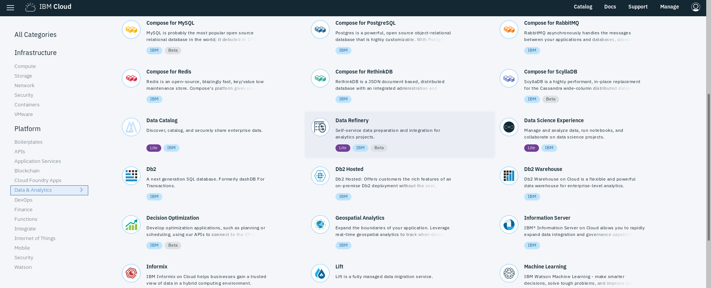

- Enter the **service name** or keep the default value and make sure to select the **US South** as the **region/location** and your desired **organization**, and **space**.
- Since this service is still in Beta, you will notice that **Beta** is the only **Plan** available under **Pricing Plans** and is already selected. Please note you are only allowed one instance of this service.
- Click on **Create**.

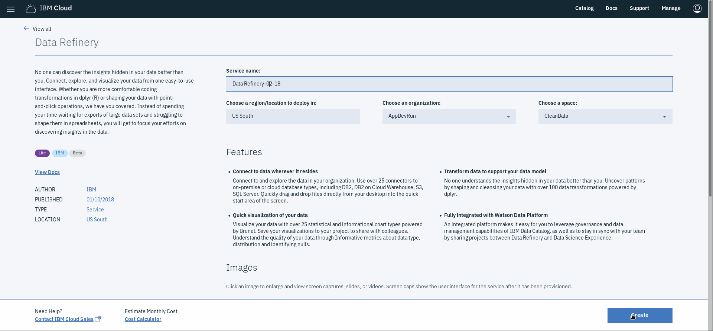

- You will be taken to the main page of the service. Click on **Get Started**. This will take you to 
the **IBM Watson Data Platform**. If this is your first time on this platform and you don't have an associated account, you will be asked to sign up.

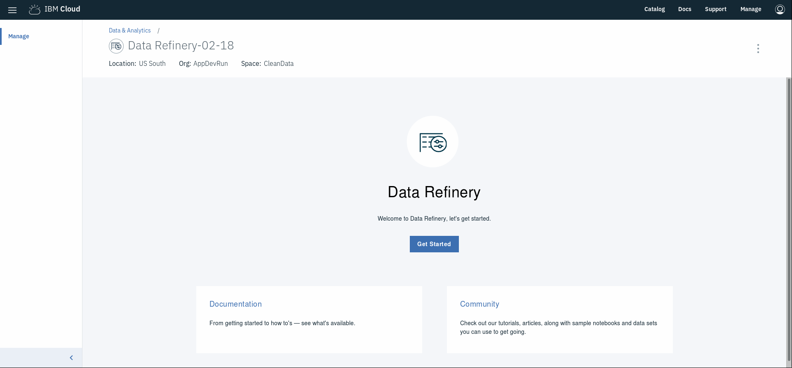

## Create a New Project
- On the **IBM Watson Data Platform** main page, click on **New Project** Under **Get started with key tasks**.

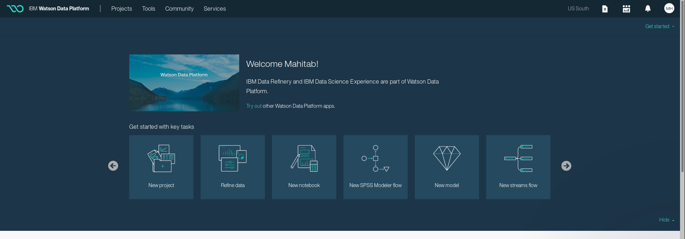

- Enter a **Name** and **Description** for your new to-be-created project.
- Under **Define storage**, add a new **IBM Cloud Object Storage** instance by clicking on **Add**.
- In the new window that gets opened, select **Lite** as the **Plan** and click **Create**.
- Enter the **Service name** or keep the default value.
- Click on **Confirm**.
- Click on **Refresh** to see the newly created service instance and get it selected.
- Under **Define compute engine**, add a new **IBM Analytics for Apache Spark** service by clicking on **Add**.
- In the new window that gets opened, select **Lite** as the **Plan** and click **Create**.
- Enter the **Service name** or keep the default value and select the **Space** in which you want the service to be created.
- Click on **Confirm**.
- Click on **Refresh** to see the newly created service instance and get it selected. If you have multiple Spark service instances created, choose the one you want to use.
- You can select to **Restrict who can be a collaborator** under **Choose project options** if you wish to do so at this stage.
- Click on **Create**

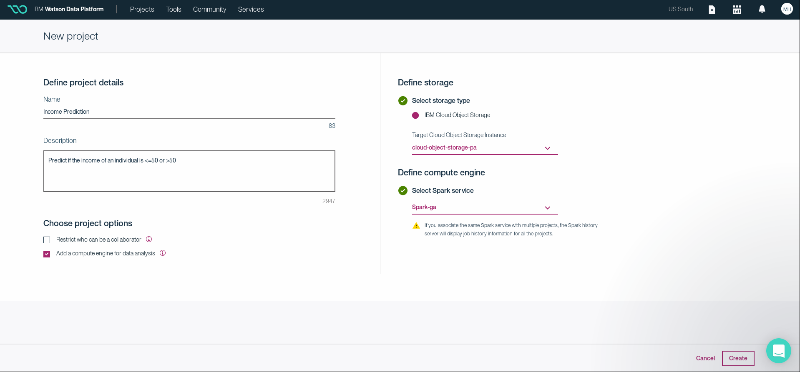

## Adding the data assets
- You should be taken to a page showing an **Overview** of the project you just created.
- Click on **Assets** on the panel found under the name of your project at the top of the page.
- At the top right of the page, click on the icon that has zeros and ones (two of each)
- Click on **Load** and drag and drop the two files **adult_person_info.csv** and **adult_org_info.csv**, which can be found this GitHub repository under the folder **Data sets**.
- You will notice that once the files are uploaded, they will be added under **Data assets**.

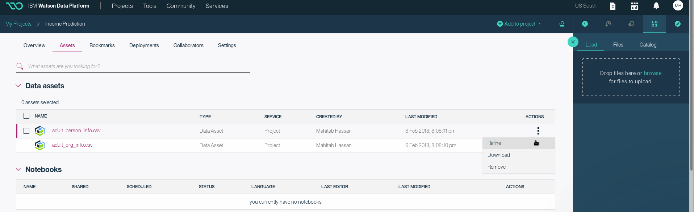

## Start refining the data
- Go to the triple dot menu next to next to **adult_person_info.csv** under **Data assets** and select **Refine**. This will open a page that shows a sample of the content, where you can start cleaning and reshaping the data set.
- On the panel on the right, you will find **Details** including the project the data asset belongs to, and description of the resulting data set we will get after the refining process. Close it for the time being.
- Click on **Steps**, which you can find right hand-side of the page. This is where you will see each operation you will define while transforming the data. It shows the data flow defining the operations to be done on the entire data set.

- Click on the **Profile** tab and talk quick look at data summary and get a feel of you data (do this after skimming through your data displayed in the **Data** tab). You will notice some weird values under **FREQUENCY** for some fields. For example, you will notice that some values under *AGE* contain additional string and there multiple values under *SEX* that seem to be meant to represent the value *Male*). You will also notice that *EDUCATION* and *EDUCATION-NUM* seem to have the same frequency values. We will get back to this in a bit.

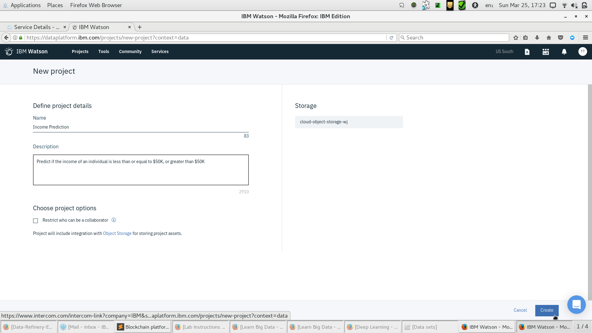

### Joining two data sets
- Click on the **Data** tab to see a sample of your data.
- Click on **+ Operation** and then select **Join**, which you can find under **ORGANIZE**. This to join both the data assets we added namely the one we are currently refining, *adult_person_info.csv**, and **adult_org_info.csv**.
- Select **Inner join** as the method of how we want our data to be combined.
- By default, the **Source** is selected as the current data asset (**adult_person_info.csv**). 
type of joining choose **adult_org_info.csv** as the **Data set to join**.
- Modify the **Suffix** field as you desire, which is just a way for you to differentiate any duplicate fields resulted during the joining process. You can use the default values.
- For the **JOIN KEYS**, select *UNIQUE_ID* representing the employee ID, as the join key for b.oth data sets and click **Next**
- Select all fields and click **Apply**.

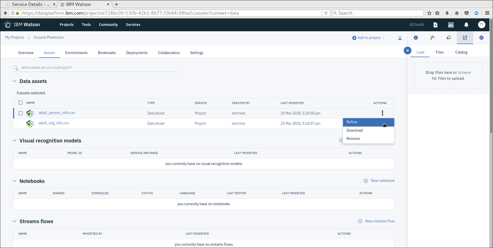

- We will notice that there are 2 columns representing *OCCUPATION*, one coming from each of the data sets. Let's check to see if they contain the exact same values.
- Click on **+ Operation** and select **Calculate**, which you can find under **FREQUENTLY USED**.
- Choose *OCCUPATION.x* as the **Selected column**, **Is equal to ** as the **Operation** and *OCCUPATION.y* as the **COLUMN**.
- Select to **Create new column for the results** and enter the **New column name**.
- Click **Apply**. You will see the resulting column added at the right end of the table.

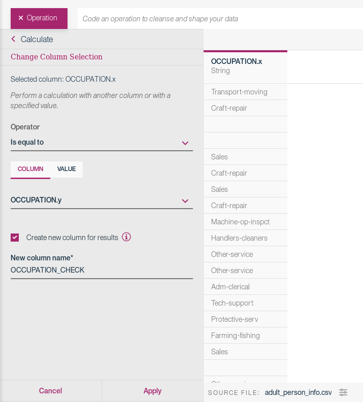

- In the space next to the **+ Operation** button, place the cursor and select **count**.
- Click on the **count** that was added to the box and select **count(`<column>`)**.
- Click on **<column>** and choose the newly created column (we called it *OCCUPATION_CHECK*).

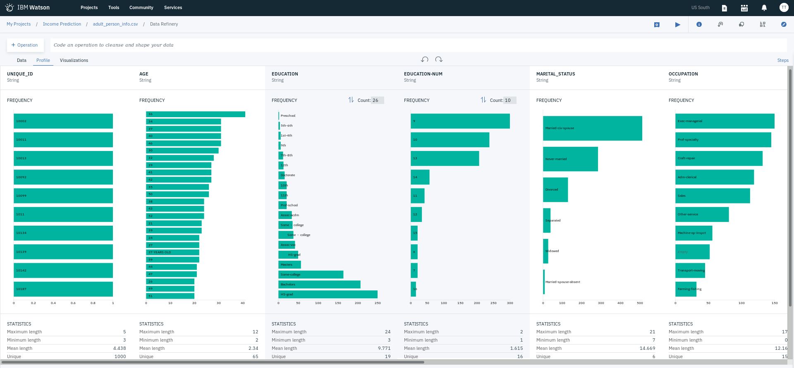
	
- In our case, we will see that all fields that had values were identical in both *OCCUPATION.x*
and *OCCUPATION.x*, which is indicated as we can only see *true* as the only value with the newly created column. In other cases, we might see that some values are not identical due to one reason or the other. In such situations, what we can do is select the column we get from the data asset coming from the more trusted source.

- Go back 2 steps by either clicking on the Undo shaped button found at the top right of the page or by going to the step added under **Steps** and clicking on the bin icon. Whichever way you select, you will need to do it twice.

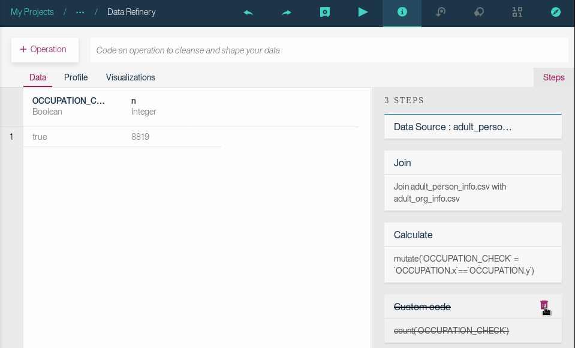

- Go to column called *OCCUPATION.x* and rename it to *OCCUPATION* by clicking on the pencil shaped icon next to the column name.

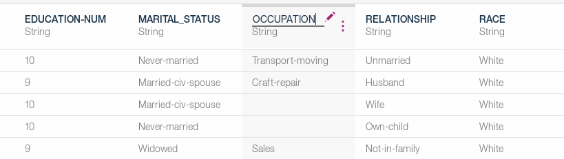

- Go to column called *OCCUPATION.y* and remove by clicking on the triple dot menu next to the column name and selecting **Remove column**.

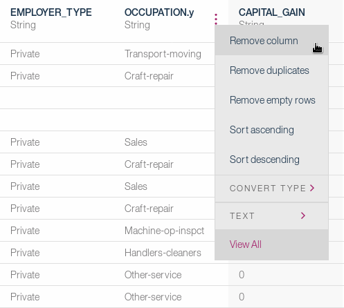

### Removing useless data
-  Click on the **Profile** tab and take a closer look at the column *EDUCATION* and *EDUCATION-NUM*. You will notice they have the same frequencies.

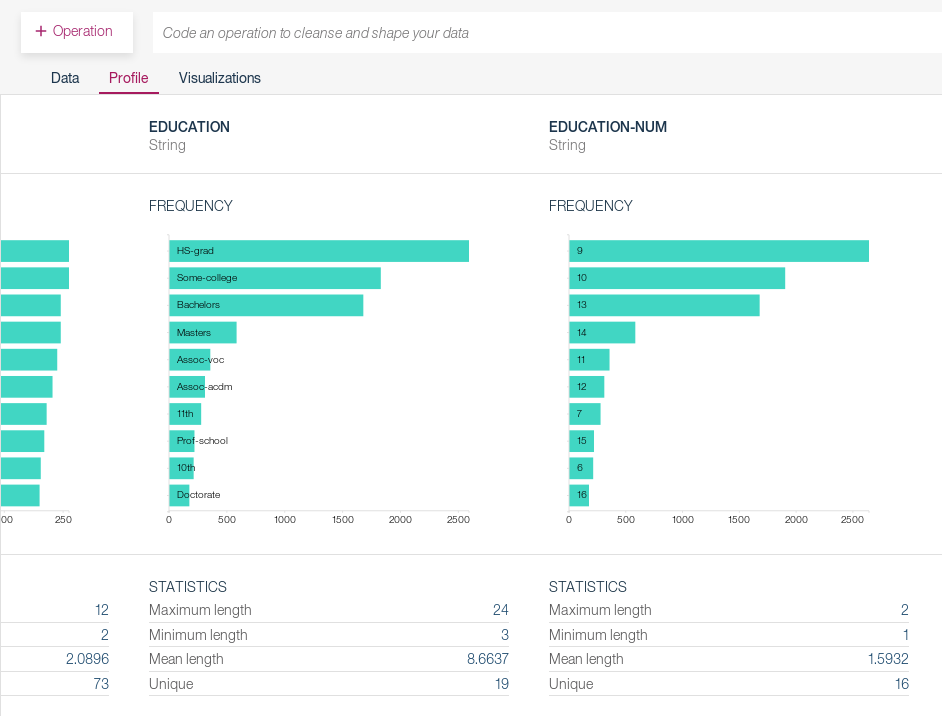

- Click on the  **Visualization** tab to confirm this and select *EDUCATION* and *EDUCATION-NUM* as the **Columns** and **Scatterplot** as the **Chart types**.
- You will notice that each of the circles drawn correspond to a value from each column, confirming that they overlap and are indeed the same thing.

- Go back to the **Data** tab and remove the column *EDUCATION-NUM* the same way we did with *OCCUPATION.y*.

### Harmonization and standardization of data
#### Harmonization data in the *EDUCATION* field
- Click on the **Profile** tab and take a closer look at the column *EDUCATION*. You notice there are some additional values with extra spaces at the beginning and possibly the end of the string.

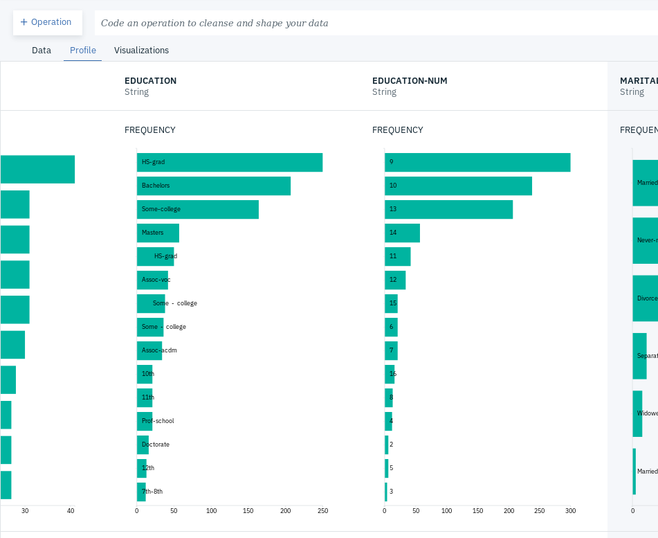

- Click on **+Operation** and select **Text**, which you can find under **FREQUENTLY USED**.
- Choose *EDUCATION* as the **Selected column**, **Trim spaces ** as the **Text Operation** and *Both* as the **Side to trim**.
- Click **Apply** and go to the **Profile** tab again to check if all the additional values have been removing. You will notice the we still have *Some  -  college* as an additional value, which we want to harmonize and change to *Some-college*.

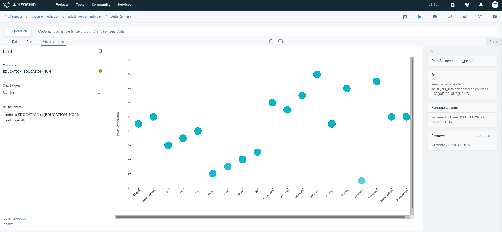

- Click on **+Operation** and select **Replace substring**, which you can find under **CLEANSE**.
- Choose *EDUCATION* as the **Selected column**. Under **TEXT** tab, type *Some  -  college* under **Enter the string to be replaced** and *Some-college* under **Enter the string replace with**. Make sure to select **Replace all occurrences**
- Click **Apply**.

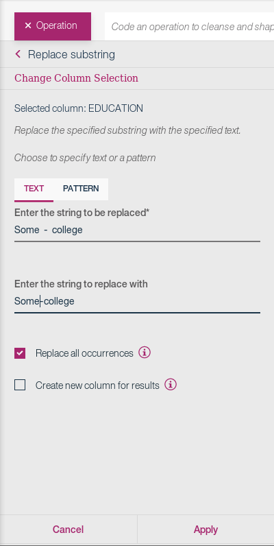

- We also want to convert all values in the *EDUCATION* column to lower case. So, click on **+Operation** and select **Text**, which you can find under **FREQUENTLY USED**.
- Choose *EDUCATION* as the **Selected column**, **Lower case** as the **Text Operation**.
- Click **Apply** and go to the **Profile** tab again to for a final check.

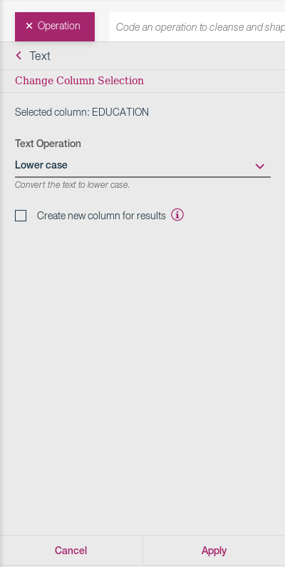

#### Harmonization data in the *SEX* field
- Click on the **Profile** tab and take a closer look at the column *SEX*. You will notice some additional values other than *Male* and *Female*, mainly ones that we want to change to *Male*.

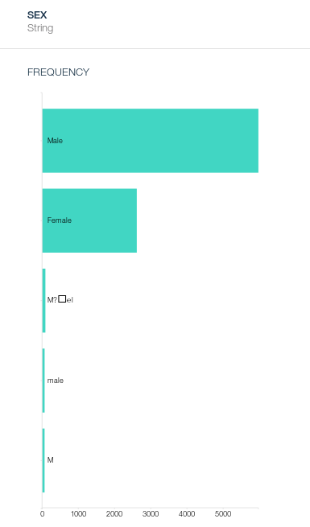

- Click on **+Operation** and select **Replace substring**, which you can find under **CLEANSE**.
- Choose *SEX* as the **Selected column**. Under **PATTERN** tab, type <i>^(?!(Male|Female))([Mm].*)</i> under **Regular expression** and *Male* under **Enter the string replace with**. Make sure to select **Replace all occurrences**.

What is meant by <i>^(?!(Male|Female))([Mm].*)</i> is to find any expression that doesn't start with *Male* or *Female* and starts with the letter *M* or *m*, which could be followed by any character.

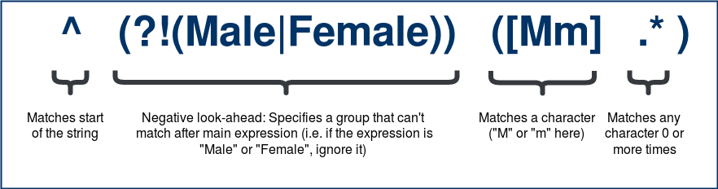

- Click **Apply** and go to the **Profile** tab again to for a final check.

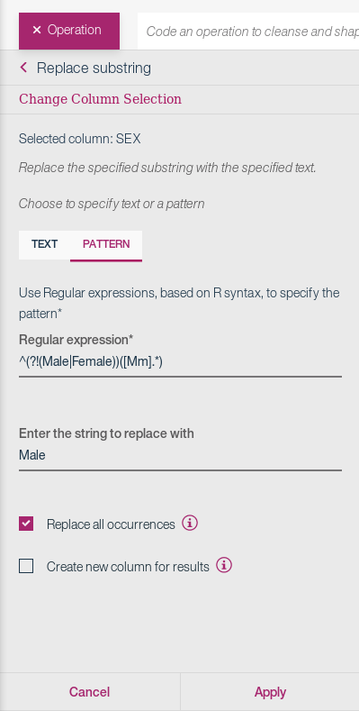

#### Harmonization data in the *AGE* field
- Click on the **Profile** tab and take a closer look at the column *AGE*. You will notice some values with additional string such as *years old*. What we want is to just retain the numerical part, which can only be a two-digit number in our case (we know there are no additional characters that were added before the numerical part of the values or that the digits contain no weird characters).

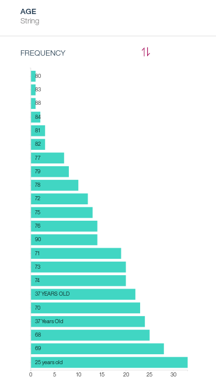

- Click on **+Operation** and select **Split column**, which you can find under **ORGANIZE**.
- Choose *AGE* as the **Selected column**. Under **POSITION** tab, type *2* under **Positions** and *AGE_num,AGE_str* under the **Names of new columns**. Make sure to unselect **Keep original column**
- Click **Apply**.

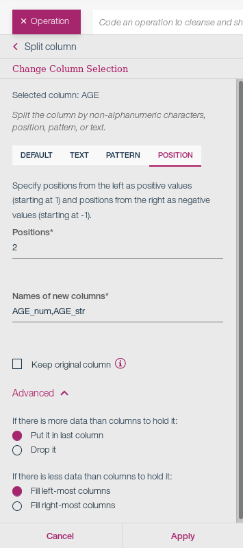

- Go to the **Data** tab and remove the newly created column called *AGE_str*, which only contain the string part of the age.
- Go to column called *AGE_num* and rename it to *AGE*.
- Go to the **Profile** tab again to for a final check.

### Remove duplicate values based on the *UNIQUE_ID*
- Go to the **Data** tab.
- Go to the column called *UNIQUE_ID* and remove rows with any duplicate *UNIQUE_ID* values by clicking on the triple dot menu next to the column name and selecting **Remove duplicates**.

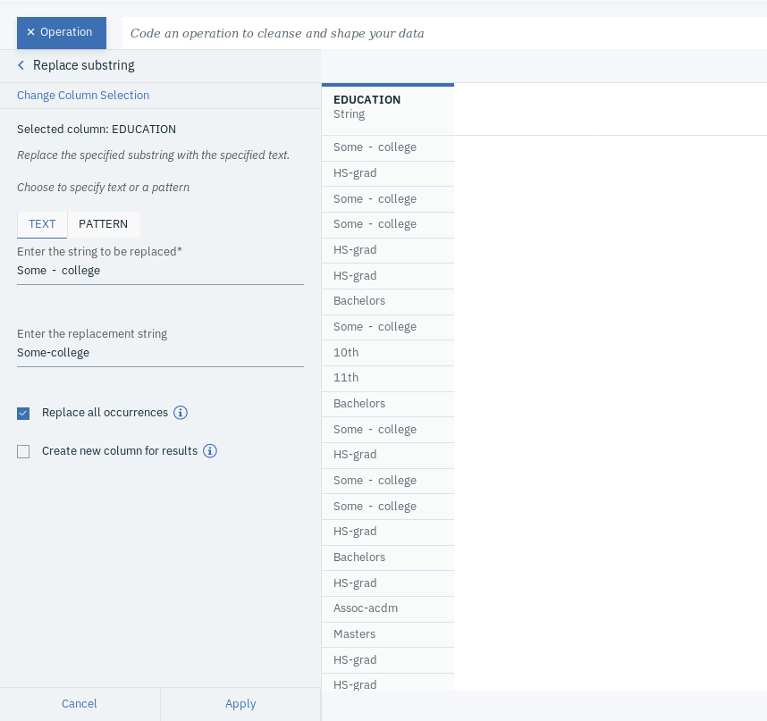

### Change the column data type
- Go to the **Data** tab.
- Go to the column called *AGE* and change its type to Integer by clicking on the triple dot menu next to the column name and selecting **CONVERT TYPE** followed by selecting **Integer**.

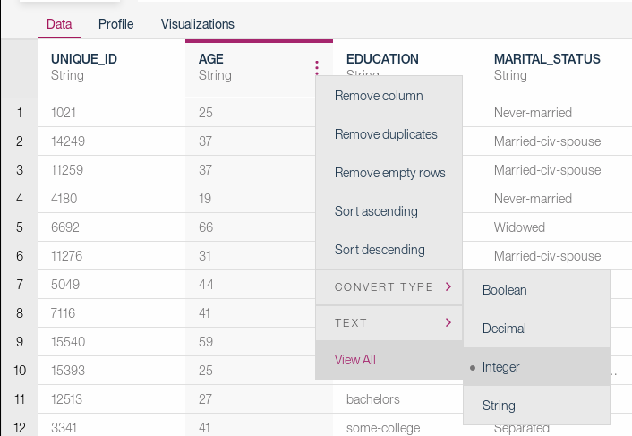

- In the same way, change the data type of *CAPITAL_GAIN*, *CAPITAL_LOSS* and *HOURS_PER_WEEK* to **Decimal**.

### Removing empty rows (List-wise deletion)
- Go to the **Data** tab.
- Go to the column called *AGE* and remove rows with any empty values by clicking on the triple dot menu next to the column name and selecting **Remove empty rows**. Do the same thing to all the other columns.

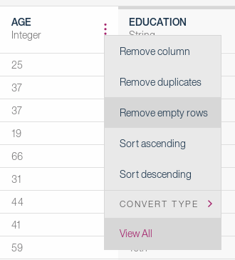

- Go to the **Profile** tab to check if all empty values have been remove.
Note that you will typically try to understand the different reasons behind having missing values and act accordingly. Some of the techniques used in such situations may include:
- Using deletion methods such as:
	- List-wise deletion
	- pairwise deletion
- Single imputation methods such as:
	- Mean/Mode substitution
	- Regression Imputation
- Model-based methods such as:
	- Maximum Likelihood
	- Multiple Imputation

### Filter data by *AGE*
- Go to the **Data** tab.
- Click on **+ Operation** and select **Filter**, which you can find under **FREQUENTLY USED**.
- Choose *AGE* as the **Selected column**, **Is between two numbers** as the **Operator** and *18,50* as the **Value**. This will only keep the rows that have age values between 18 and 50.
- Click **Apply**.

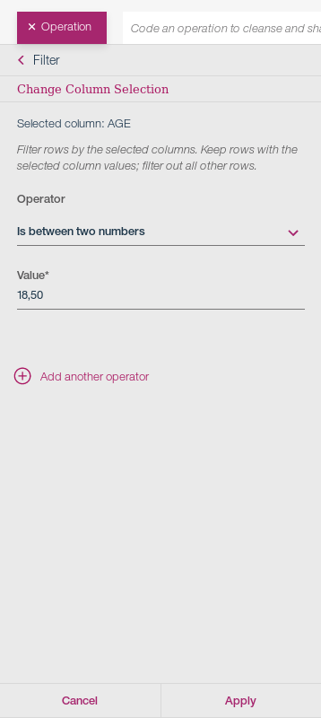

### Rounding up the values in *CAPITAL_LOSS*
- Go to the **Data** tab.
- Click on **+ Operation** and select **Math**, which you can find under **FREQUENTLY USED**.
- Choose *CAPITAL_LOSS* as the **Selected column** and **Ceiling** as the **Math Operation**.
- Click **Apply**.

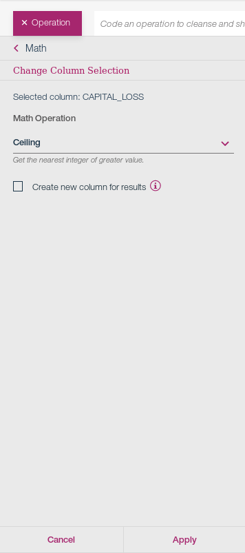

## Running the data flow
- At this point, you should have 32 **Steps**. The next step is to click on the play button to run the data flow as seen below.

- This will take you to a page where you will need to configure the **Data flow details** and **Data flow output** if you haven't already done so in the **Details** panel, which we mentioned earlier at the beginning of the **Start refining the data** section. Feel free to change the **Name** under **Data flow details** to *adult_income.csv_flow* and the **Name** under **Data flow output** to *adult_income_shaped.csv*.
- Click on **Save and Run**

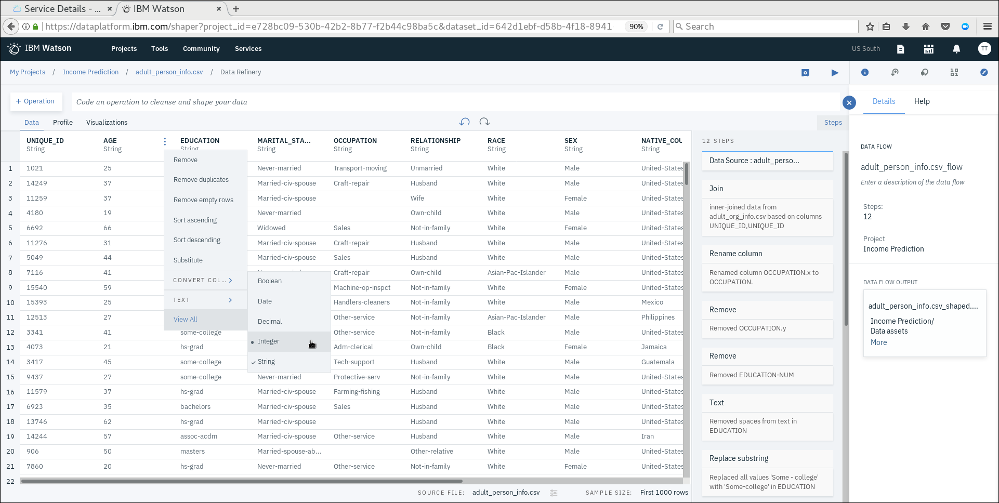

- In the window that pops up, click on **View Flow** to track the progress of the running data flow.
- The data flow should start running, executing each of the operations we defined. If  things goes well, you should see the page similar to the one displayed below.

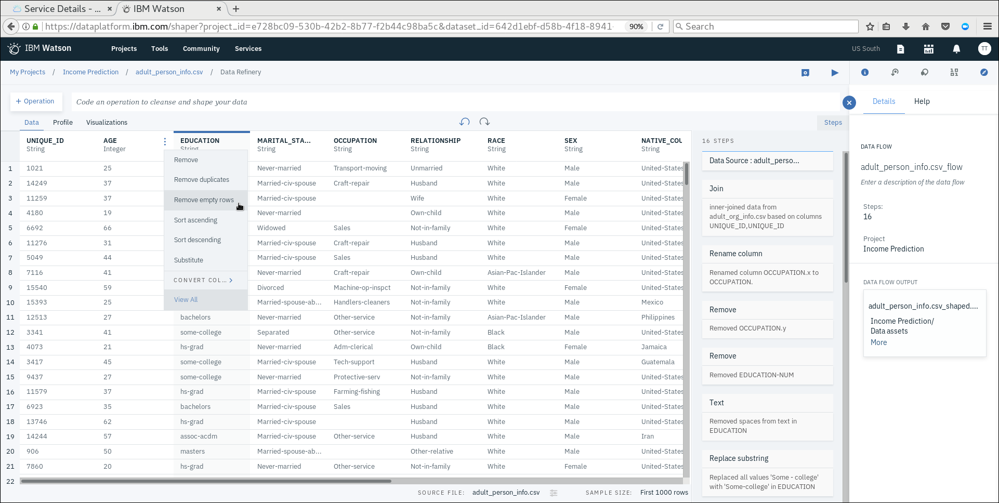

If you go back to the **Assets** page of your project, you will notice that the new csv file has been added as a new data asset.

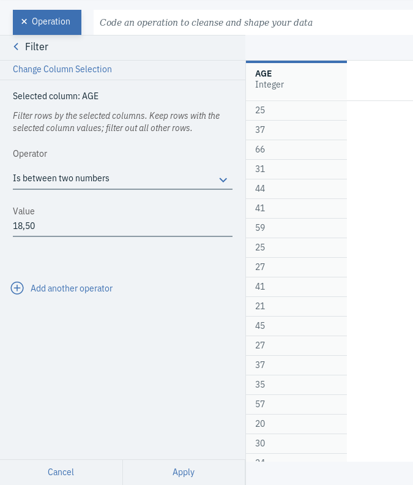

You can also find the data flow you created if you scroll down the same page, which can refine at any time by clicking on the triple dot menu next to the data flow name.

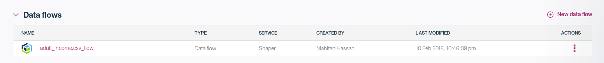

Aaaand that is it!!
